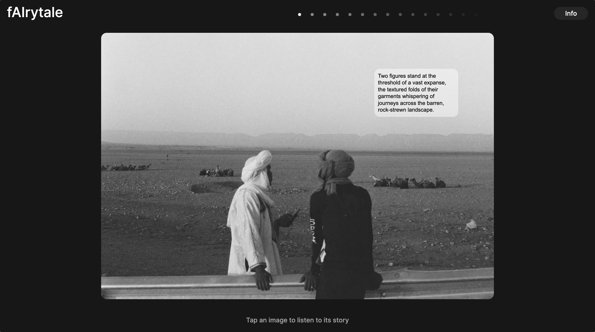
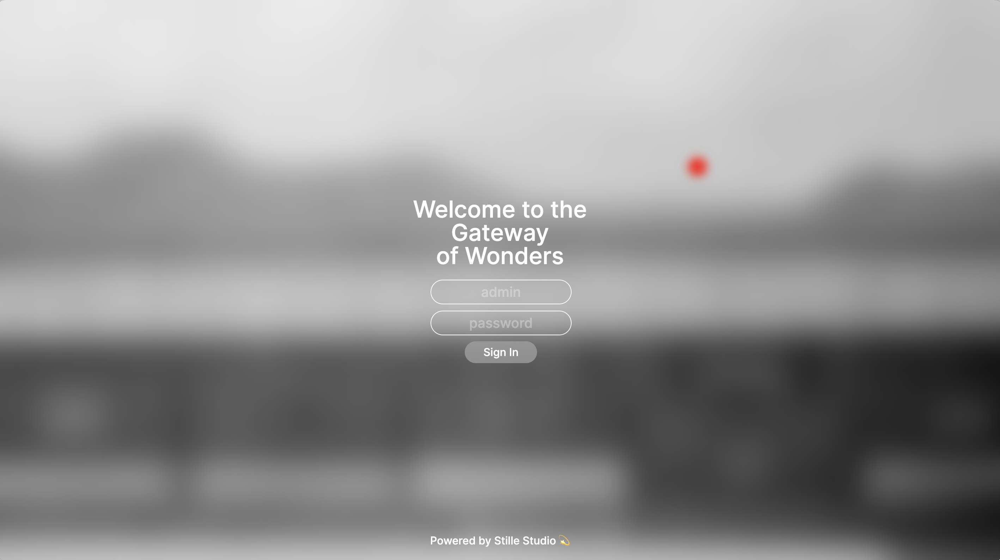

# ImageNarrator 👾 AI-Enhanced Photography Portfolio 👾

## GPT-4 Vision and Eleven Labs AI Speech experiment





## Overview

This project showcases an innovative workflow that integrates cutting-edge AI technologies with a photography portfolio. Leveraging the power of OpenAI's vision model, each image is analyzed to generate descriptive text that captures the essence of the photograph. These descriptions are then given voice through ElevenLabs' text-to-speech synthesis, creating an immersive audio-visual experience.

Content management is streamlined through Contentful, with an admin-centric approach to ensure a smooth and secure content update process.

## Features

-   **Automated Image Descriptions**: Employs OpenAI's Vision model to craft detailed narratives for photographs, enhancing viewer understanding and engagement.
-   **Immersive Audio Narratives**: Leverages ElevenLabs.io's text-to-speech technology to bring each image's story to life, offering an enriched user experience.
-   **Authentication**: Ensures a streamlined and secure workflow, allowing only admins to refine/generate and deploy new text/audio updates.

## Technologies Used

-   **OpenAI API**: For generating descriptive text based on images.
-   **ElevenLabs.io API**: For synthesizing speech from the generated text.
-   **Contentful as the CMS** for easy content updates and management.
-   **Next.js**
-   **Typescript**
-   **Tailwind**

## Purpose

Showcase the synergy between AI and photography, this project aims to provide a unique, interactive portfolio experience. It demonstrates the potential of AI to add value to visual content, making it more accessible and engaging for users.

## Getting Started

These instructions will get you a copy of the project up and running on your local machine for development and testing purposes.

### Prerequisites

-   You'll need an elevenlabs and GPT-4 paid account to make this work. I had to train a custom voice on David Attenborough.
-   Node.js (LTS version recommended)
-   npm or yarn

### Installation

Clone the repository:

```bash
git clone https://github.com/Klausstille/loic-sutter
```

Install dependencies:

```bash
npm install
# or
yarn install
```

Set up environment variables for API keys:
Create a .env.local file at the root of your project.
Add your OpenAI API key and ElevenLabs.io API key:

```env
NEXT_PUBLIC_OPENAI_API_KEY=your_openai_api_key_here
NEXT_PUBLIC_ELEVENLABS_API_KEY=your_elevenlabs_api_key_here
```

Run the development server:

```bash
npm run dev
# or
yarn dev
```

Open http://localhost:3000 with your browser to see the result.
